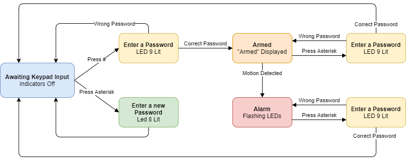

# Security System Simulator 

The goal of this project was design two devices, an ultrasonic rangefinder and a keypad. Devices were defined in VHDL and functionality was tested using Quartus and a DE-10 Lite FPGA. Our team then created a security system simulator to accomplish the demonstrate the functionality of the two devices. 

[Product Demonstration Video](https://www.youtube.com/watch?v=gpdC0Uz0qjc)

## Device Functionality
### Ultrasonic Rangefinder
The rangefinder sends out an echo and uses the time it takes to return to measure distance. This device receives a 1-bit echo input. It then outputs an incrementing number representing the distance measured. Currently, it measures distance in multiples of 1.0 mm with a 0.1 second delay and only updates the output when a new valid output is available to allow constant acquisition. Measurement acquisition rate, delay, and units can be fine tuned accordingly. 

There are negative aspects to be aware of. The rangefinder does not stop acquisition while in use. It can also potentially softlock when awaiting an echo prior to being powered. Additionally, although the theoretical maximum measurable range is ~650 cm, in practice it is ~150 cm. 

### Keypad
Once a key is pressed, it receives a 16-bit input representative of which key is pressed. The peripheral continuously rotates column by column and outputs whichever key is currently detected.
While the device supports single key presses, behavior is not defined for multiple keys pressed at once. The following table summarizes the peripheral behavior.

## Demonstration
A security system was created to demonstrate the functionality of the rangefinder and keypad. The keypad receives a password input and the rangefinder detects motion within its measurable range. States change depending on the rangefinder and keypad inputs. A more detailed explanation is shown in the image below. 

The system expresses aberrant behavior under certain conditions due to limitations such as multiple key input and maximum range. 
